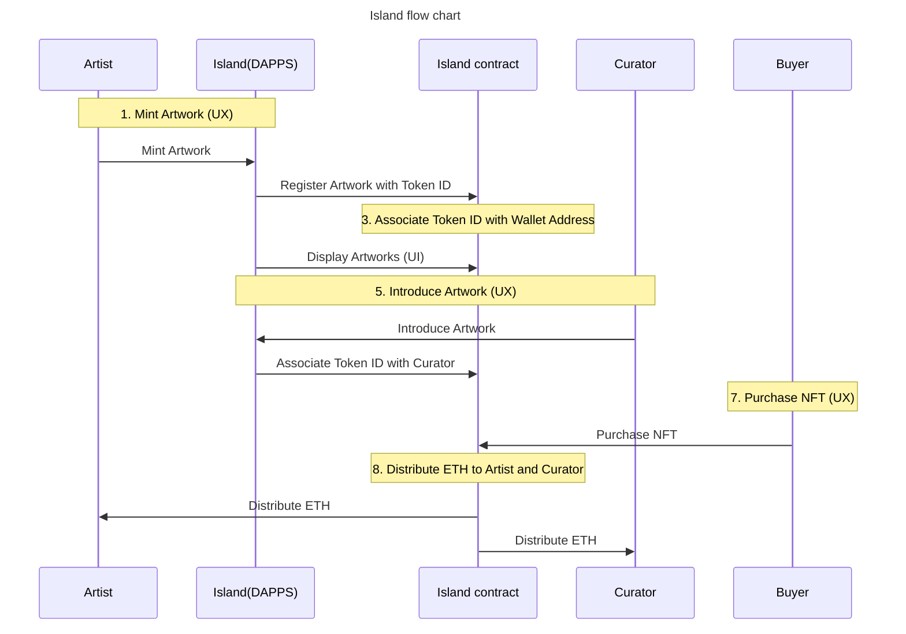

<!--
*** Thanks for checking out the Island. If you have a suggestion
*** that would make this better, please fork the repo and create a pull request
*** or simply open an issue with the tag "enhancement".
*** Don't forget to give the project a star!
*** Thanks again! 
-->

# Island　
We make a marketplace where everyone becomes a curator and curation becomes a work of art.

### Issue
OpenSea and other marketplaces simply list the price of the artwork, its transition, the number of sales, TVL, etc., and do not provide captions such as the artist's thoughts and feelings about the artwork.
**They are limited to functioning as simple sales offices.**

### Solution
Consideration of high-lighting methods for artists and works that do not depend on name recognition.
- Create a mechanism to visualize democratic evaluation that does not depend on name recognition.
- Create a system that facilitates recognition of the taste and claims of the work.
- To establish a motivation for collectors and curators to search for artists and artworks. Establish motivation for collectors and curators to search for artists and artworks.
- Provide an opportunity to lead users from one work or one artist to other works or other artists. Provide an opportunity to lead users from one work or one artist to other works or other artists.

## Island Ecosystem

(<a href="#top">back to top</a>)

## Idea

**Tell us what you guys thinking. Let's create a market where we can all be truly P2P!**

(<a href="#top">back to top</a>)

## Exhibition

Island 2023
at CCBT - Civic Creative Base Tokyo in Shibuya.
Artists: Kumagai Akira, Takahashi Ryuta, Suzuki Yushin, Habu Kazuhito

Organised by CCBT for ‚Future Ideations Camp Vol.2 setup():

## Statement
In a vast marketplace such as OpenSea where there are rows after rows of works belonging to mega-collectors, viewers may be discouraged from even browsing the pages to search for artworks, and lesser known artists with fewer assets tend to sink into the background.
Is there a way construct a system that allows more flexibility and fluidity in the exposure of these works so that they have a better chance at entering the global market?

We believe that blockchain technology will re-define the order constructed within the current digital ecosystem. Islands: curation media + NFT marketplace is a platform where users can curate works according to their aesthetics and create “islands” themselves, ultimately resulting in the creation of a group of archipelagos. Each island becomes a reflection of the user’s own worldview where unique cultures can flourish. When each of these islands connect and interact, the works will flow with more fluidity and will stimulate a more active movement within the market as a whole.

(<a href="#top">back to top</a>)

